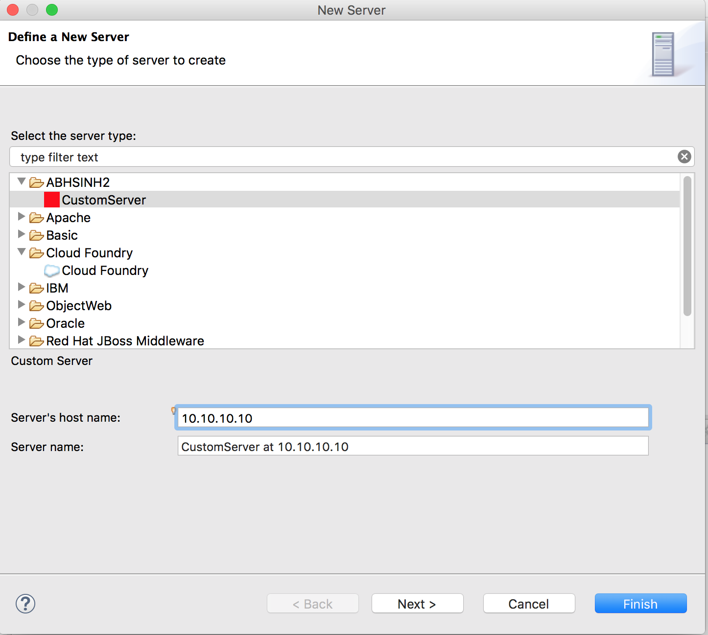
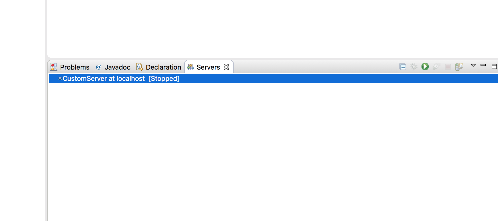
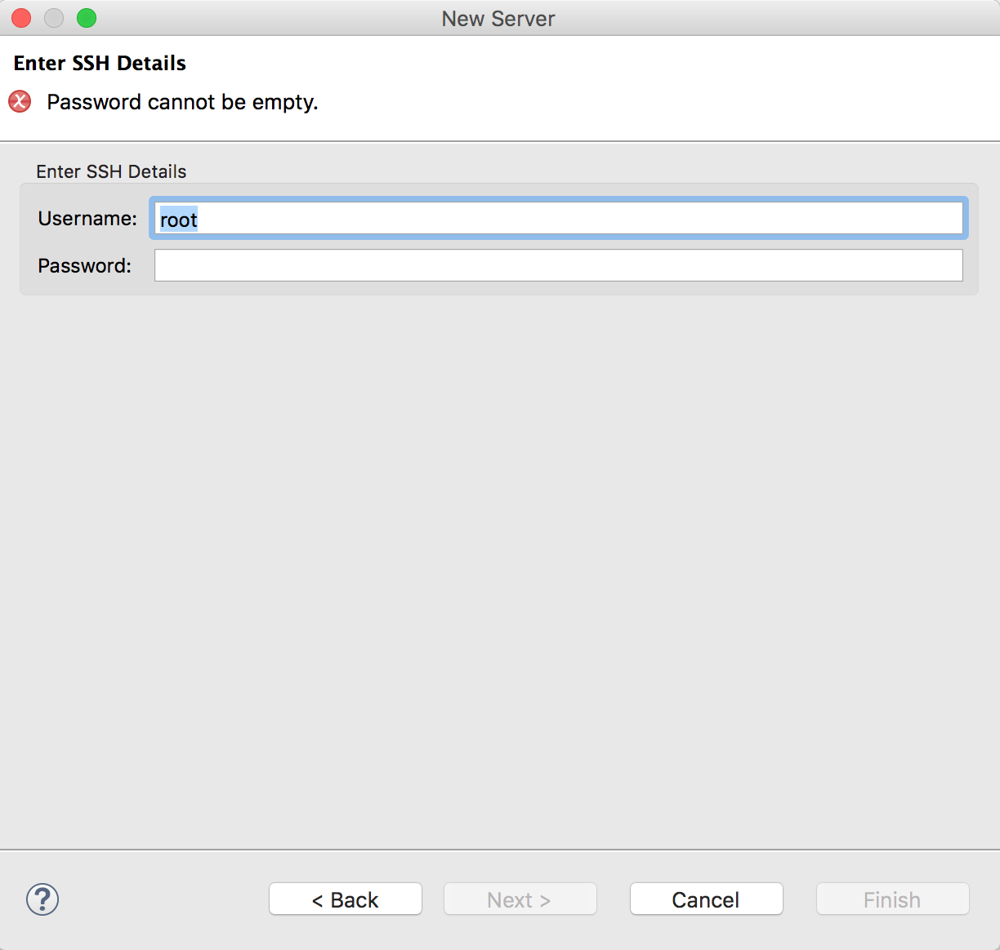
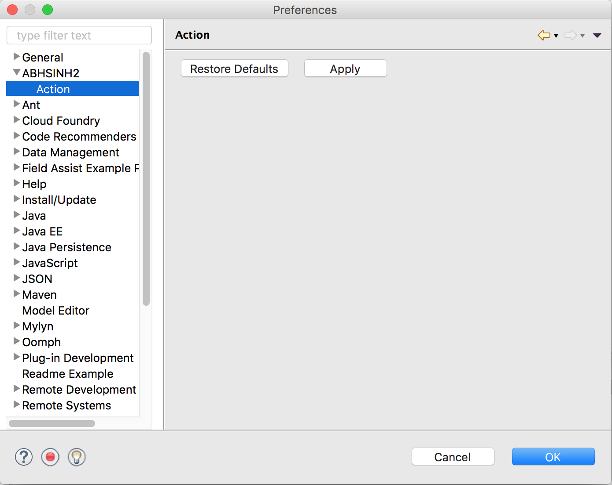
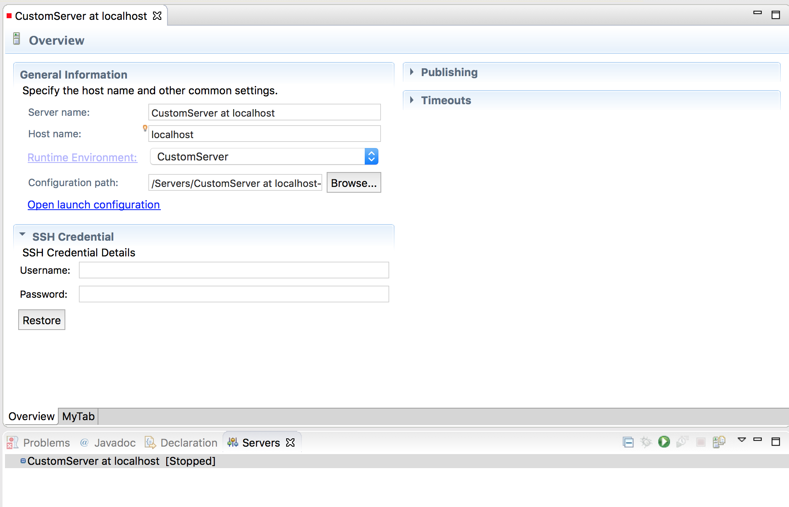
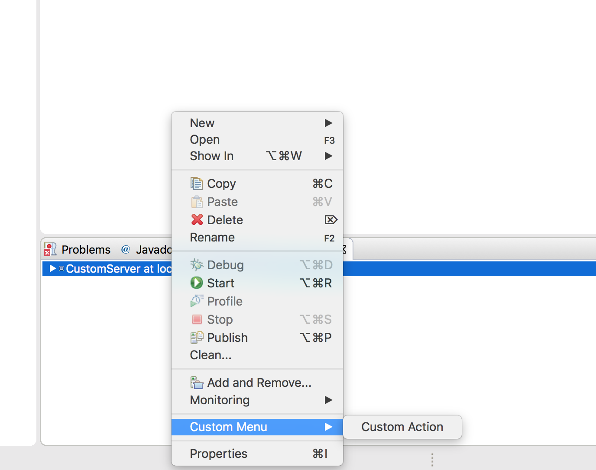
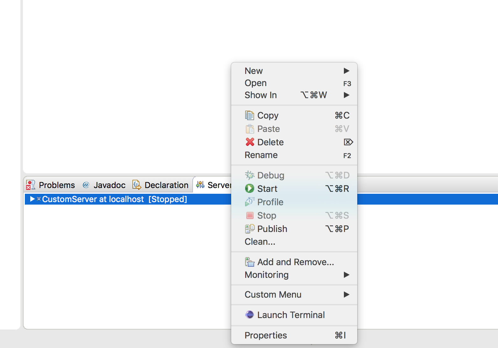
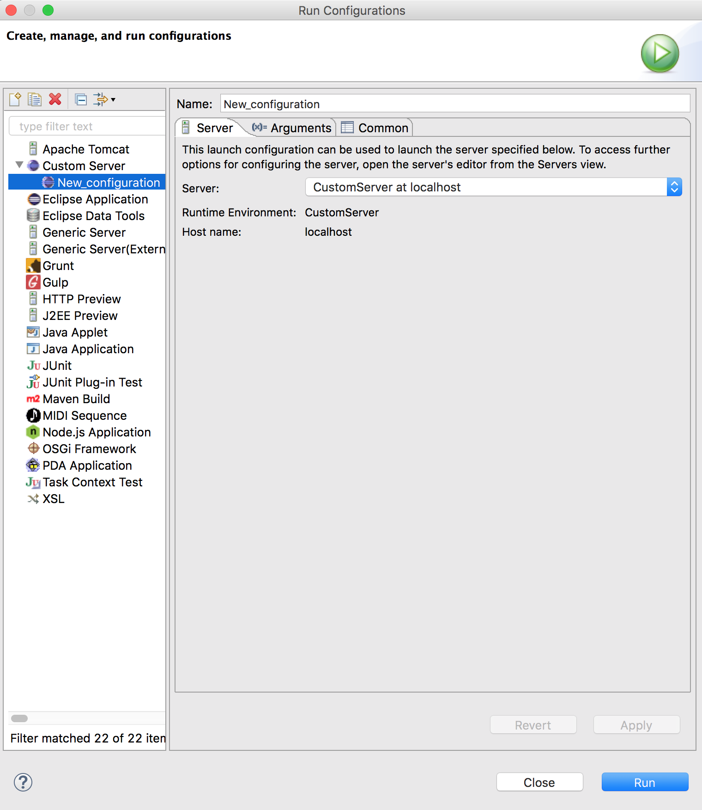
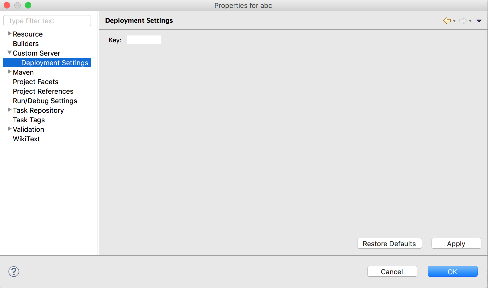

### Create custom server type

	<!--This extension point is used to provide a new runtime type. -->
	<extension point="org.eclipse.wst.server.core.runtimeTypes">
		<runtimeType
            class="com.abhsinh2.server.delegates.CustomServerRuntimeDelegate"
            description="Custom Server"
            id="com.abhsinh2.server.customRuntimeServer"
            name="CustomServer"
            vendor="ABHSINH2" />
	</extension>
	
	
   
	public class CustomServerRuntimeDelegate extends RuntimeDelegate {
	
	}
	

	<!-- This extension point is used to provide support for a new server type. -->
	<extension point="org.eclipse.wst.server.core.serverTypes">
		<serverType
            behaviourClass="com.abhsinh2.server.delegates.CustomServerBehaviourDelegate"
            class="com.abhsinh2.server.delegates.CustomServerDelegate"
            description="Custom Server"
            hasConfiguration="true"
            id="com.abhsinh2.server.customServer"
            initialState="stopped"
            launchConfigId="com.abhsinh2.server.customServerLaunchConfiguration"
            launchModes="run"
            name="CustomServer"
            runtime="true"
            runtimeTypeId="com.abhsinh2.server.customRuntimeServer"
            startBeforePublish="true"
            startTimeout="6000000"
            stopTimeout="3000000"
            supportsRemoteHosts="true" />
	</extension>


	public class CustomServerBehaviourDelegate extends ServerBehaviourDelegate {	
		@Override
		public void stop(boolean force) {
	
		}
	
		public void start(IProgressMonitor monitor) {
			System.out.println("Starting code goes here");
			StatusManager.getManager().handle(Status.OK_STATUS, StatusManager.LOG | StatusManager.SHOW);
		}	
	}
	

	public class CustomServerDelegate extends ServerDelegate {	
		@Override
		public IStatus canModifyModules(IModule[] addedModules, IModule[] removedModules) {
			return null;
		}
	
		@Override
		public IModule[] getChildModules(IModule[] module) {
			return null;
		}
	
		@Override
		public IModule[] getRootModules(IModule module) throws CoreException {
			return null;
		}
	
		@Override
		public void modifyModules(IModule[] addedModules, IModule[] removedModules, IProgressMonitor monitor) throws CoreException {
	
		}	
	}
	




### Custom server in Servers view





### Add custom wizard page while creating new server


	<extension point="org.eclipse.wst.server.ui.wizardFragments">
		<fragment id="com.abhsinh2.server.customWizardFragment"
			typeIds="com.abhsinh2.server.customServer"
			class="com.abhsinh2.server.wizards.CustomServerWizardFragment" />
	</extension>
	
	



### Add Preference page from new server


	<extension point="org.eclipse.core.runtime.preferences">
		<initializer class="com.abhsinh2.server.preferences.CustomServerPreferenceInitializer" />
        <modifier class="com.abhsinh2.server.preferences.CustomServerPreferenceModifyListener" />
	</extension>	
	<extension point="org.eclipse.ui.preferencePages">
		<page class="com.abhsinh2.server.preferences.CustomServerPreferencePage"
            id="com.abhsinh2.server.preferences.CustomServerPreferencePage"
            name="ABHSINH2" />
	</extension>
	<extension point="org.eclipse.ui.preferencePages">
		<page category="com.abhsinh2.server.preferences.CustomServerPreferencePage"
            class="com.abhsinh2.server.preferences.CustomServerActionPreferencePage"
            id="com.abhsinh2.server.preferences.CustomServerActionPreferencePage"
            name="Action" />
	</extension>
	
	



### Add a section in overview tab of server editor page


	<extension point="org.eclipse.wst.server.ui.editorPageSections">
		<section id="com.abhsinh2.server.customServerSection"
	   		order="0"
	   		insertionId="org.eclipse.wst.server.editor.overview.left"
	   		typeIds="com.abhsinh2.server.customServer"
	   		class="com.abhsinh2.server.editors.CustomServerConfigurationSection" />
	</extension>
	




### Add a new Tab on server editor page


	<extension point="org.eclipse.wst.server.ui.editorPages">
		<page id="com.abhsinh2.server.customServer.customMyTab"
	        order="0"
	        name="MyTab"
	        typeIds="com.abhsinh2.server.customServer"
	        class="com.abhsinh2.server.editors.CustomServerCustomEditorPage" />
	</extension>
	
	


### Add context menu using content provider


	<extension point="org.eclipse.ui.navigator.navigatorContent">
		<navigatorContent activeByDefault="true"
	       	contentProvider="com.abhsinh2.server.actions.CustomServerContentProvider"
	       	id="com.abhsinh2.server.navigatorContent"
	       	labelProvider="com.abhsinh2.server.actions.CustomServerLabelProvider"
	       	name="Custom Server Navigator Content">
			<triggerPoints>
				<instanceof value="org.eclipse.wst.server.core.IServer" />
			</triggerPoints>
			<possibleChildren>
				<or>
					<instanceof value="java.lang.Object" />
					<instanceof value="org.eclipse.wst.server.core.IServer" />
				</or>
			</possibleChildren>
			<actionProvider class="com.abhsinh2.server.actions.CustomServerActionProvider"
	       		dependsOn="org.eclipse.wst.server.ui.ServersView.ServerActionProvider"
	       		id="com.abhsinh2.server.customContextMenu"
	       		priority="lowest">
				<enablement>
					<instanceof value="org.eclipse.wst.server.core.IServer" />
				</enablement>
			</actionProvider>
		</navigatorContent>
	</extension>
	<extension point="org.eclipse.ui.navigator.viewer">
		<viewerContentBinding viewerId="org.eclipse.wst.server.ui.ServersView">
			<includes>
				<contentExtension isRoot="false" pattern="com.abhsinh2.server.navigatorContent" />
			</includes>
		</viewerContentBinding>
	</extension>
	
	



### Add context menu using command - handler


	<extension point="org.eclipse.ui.menus">
		<menuContribution locationURI="popup:org.eclipse.ui.popup.any?after=additions">
			<command commandId="com.abhsinh2.server.LaunchTerminalCommand"
	             icon="icons/sample.gif" label="Launch Terminal" tooltip="Launch Terminal">
				<visibleWhen>
					<with variable="selection">
						<count value="1" />
						<iterate>
							<instanceof value="org.eclipse.wst.server.core.IServer" />
						</iterate>
					</with>
				</visibleWhen>
			</command>
		</menuContribution>
	</extension>
	<extension point="org.eclipse.ui.commands">
		<command id="com.abhsinh2.server.LaunchTerminalCommand" name="Launch Terminal" />
	</extension>
	<extension point="org.eclipse.ui.handlers">
		<handler class="com.abhsinh2.server.handlers.LaunchTerminalCommandHandler"
	       	commandId="com.abhsinh2.server.LaunchTerminalCommand" />
	</extension>
	




### Add extension for delete server dialog


	<extension point="org.eclipse.wst.server.ui.deleteServerDialogExtension">
		<deleteServerDialogExtension
	        class="com.abhsinh2.server.actions.CustomServerDeleteDialogExtension"
	        id="com.abhsinh2.server.deleteServerDialogExtension" />
	</extension>
	
	
### Run Java/Maven projects on custom server. Following code will add option in "Run As"


	<extension point="org.eclipse.debug.core.launchConfigurationTypes">
		<launchConfigurationType
            delegate="com.abhsinh2.server.delegates.CustomLaunchConfigurationDelegate"
            id="com.abhsinh2.server.customServerLaunchConfiguration"
            modes="run"
            name="Custom Server"
            public="true" />
	</extension>
	<extension point="org.eclipse.debug.ui.launchConfigurationTabGroups">
		<launchConfigurationTabGroup
            class="com.abhsinh2.server.delegates.CustomServerLaunchConfigurationTabGroup"
            id="com.abhsinh2.server.customServerLaunchConfigurationTabGroup"
            type="com.abhsinh2.server.customServerLaunchConfiguration" />
	</extension>
	<extension point="org.eclipse.debug.ui.launchConfigurationTypeImages">
		<launchConfigurationTypeImage
            id="org.eclipse.jst.server.generic.image.ui.ExternalLaunchConfigurationTypeImage"
            configTypeID="com.abhsinh2.server.customServerLaunchConfiguration"
            icon="icons/sample.gif" />
	</extension>
	
	



### Add custom server options to properties of Java/Maven projects (Right click on Maven project and click properties)


	<extension point="org.eclipse.ui.propertyPages">
		<page class="com.abhsinh2.server.ui.CustomServerParentPropertyPage" 
			id="com.abhsinh2.server.parent" 
			name="Custom Server">
			<filter name="nature" value="org.eclipse.jdt.core.javanature" />
			<filter name="nature" value="org.eclipse.m2e.core.maven2Nature" />
		</page>
	</extension>
	<extension point="org.eclipse.ui.propertyPages">
		<page category="com.abhsinh2.server.parent" 
			class="com.abhsinh2.server.ui.CustomServerCustomDetailsPropertyPage"
          	id="com.abhsinh2.server.customDetails"
          	name="Deployment Settings">
			<filter name="nature" value="org.eclipse.jdt.core.javanature" />
			<filter name="nature" value="org.eclipse.m2e.core.maven2Nature" />
		</page>
	</extension>
	



### To create directory in Server project of workspace

```
server.getServerConfiguration().getLocation()
```

make sure you have enabled ```hasConfiguration="true"``` in org.eclipse.wst.server.core.serverTypes extension


		
